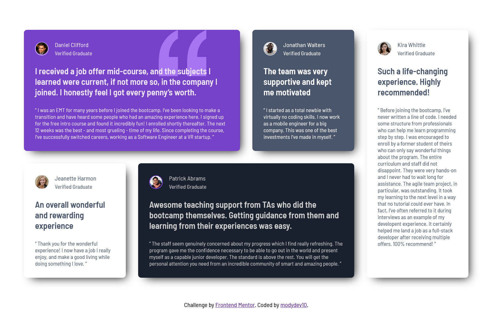

# Frontend Mentor - Testimonials grid section solution

This is a solution to the [Testimonials grid section challenge on Frontend Mentor](https://www.frontendmentor.io/challenges/testimonials-grid-section-Nnw6J7Un7). Frontend Mentor challenges help you improve your coding skills by building realistic projects. 

## Table of contents

- [Overview](#overview)
  - [The challenge](#the-challenge)
  - [Screenshot](#screenshot)
  - [Built with](#built-with)
  - [What I learned](#what-i-learned)
  - [AI Collaboration](#ai-collaboration)
- [Author](#author)

**Note: Delete this note and update the table of contents based on what sections you keep.**

## Overview

a challenge that requires building a complex layout that will
be better done using grid layout

### The challenge

Users should be able to:

- View the optimal layout for the site depending on their device's screen size

### Screenshot

- Solution URL: (https://github.com/modydev10/testimonials-grid-section)
- Live Site URL: (https://modydev10.github.io/testimonials-grid-section/)

### Built with

- Semantic HTML5 markup
- Flexbox
- CSS Grid

### What I learned

Use this section to recap over some of your major learnings while working through this project. Writing these out and providing code samples of areas you want to highlight is a great way to reinforce your own knowledge.

I relaized that relying on grid-row and grid-columns to determine the size of
an element is a little tricky and probably not a best practice

### AI Collaboration

I asked Gemini to give me a box-shadow value that makes an element obvious without
giving it borders. in short, a box-shadow value that does the job of borders .

## Author

- Github - [modydev10](https://github.com/modydev10)
- Frontend Mentor - [@modydev10](https://www.frontendmentor.io/profile/modydev10)